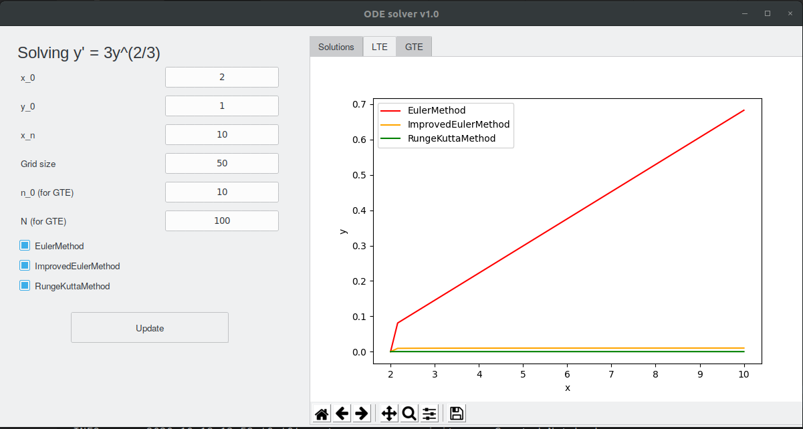
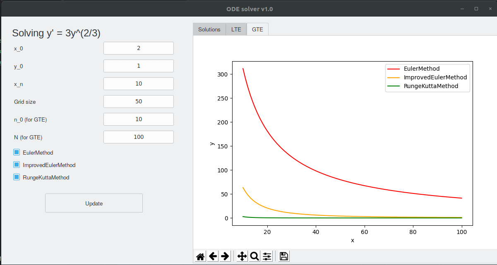

DE graph plotting
===

### Start
1. Install requirements
```bash
python3 -m pip install -r requirements.txt
```
2. Configre `constants.py` file
3. Run the app 
```bash
python3 run.py
```

### Pictures
1. Solution tab


2. LTE tab



3. GTE tab



4. Example of chart analysis

